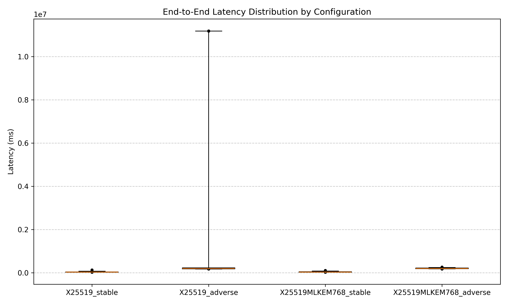
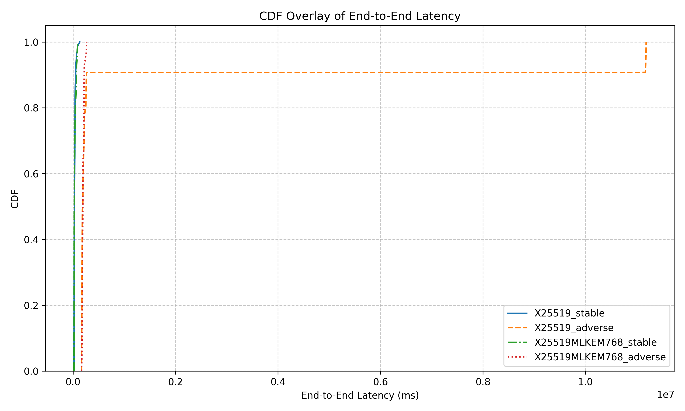
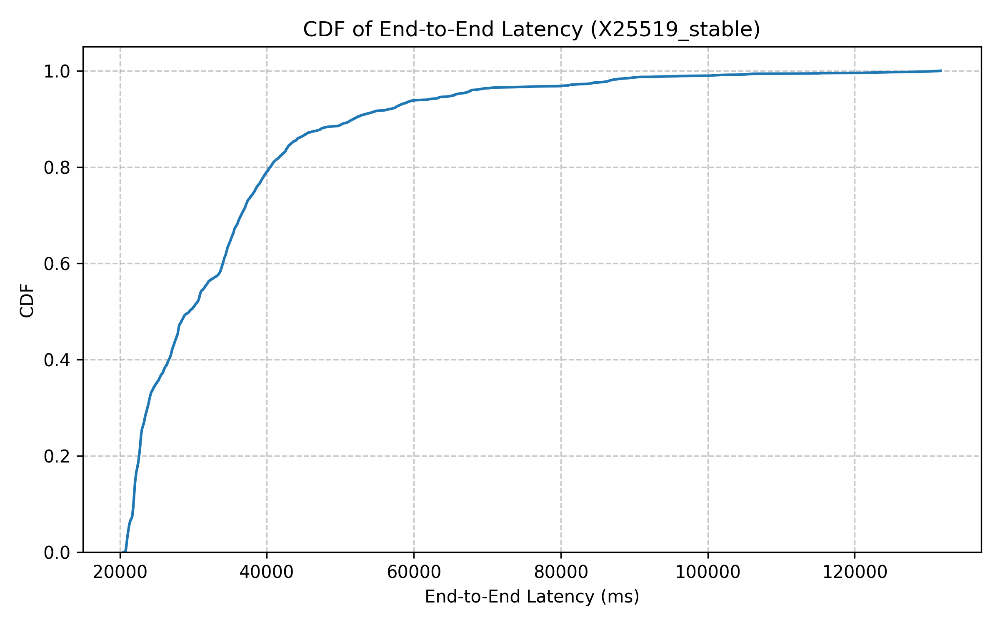
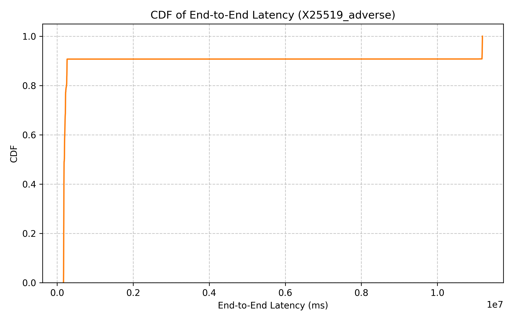
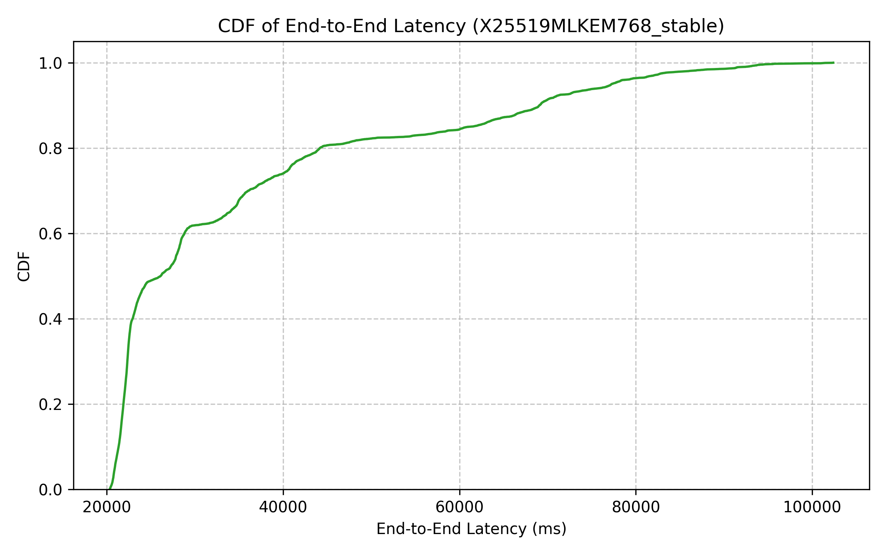
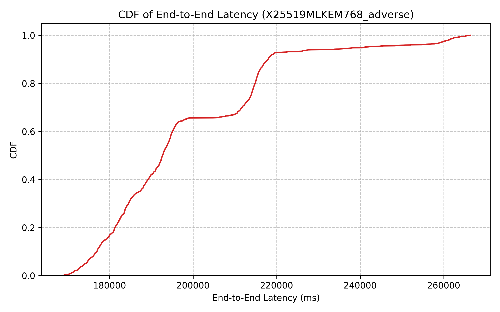

# Phase 7 Traceability Report

## Section 1: Environment

The benchmarking environment used for these evaluations is defined as follows:

*   **Hardware Specifications:** 
    *   CPU: Intel Core i5-10300H @ 2.50 GHz (4C/8T, Comet Lake)
    *   RAM: 16 GB
    *   GPU: NVIDIA GTX 1650
    *   OS: Windows 64-bit
*   **Software Versions:**
    *   Docker version: 28.5.1
    *   Docker Compose version: v2.40.0-desktop.1
    *   OpenSSL version: OpenSSL 3.5.7 9 Jun 2026 (from within the gateway containers)
    *   Python version: 3.14.6
    *   OS Kernel version: 10.0.19045 (Windows 10 Build 19045)
*   **Docker Resource Pinning:** Gateway containers (both A and B) are constrained to limit environmental variance, pinned to `cpus: '2'` and `memory: 4G` via `compose.yaml`.

## Section 2: Methodology

*   **Network Profiles (`netem` parameters):**
    *   **Stable:** No artificial constraints injected (baseline loopback/Docker network).
    *   **Adverse:** Tactical network simulation with 50ms delay ± 10ms jitter, 3% packet loss, and a 5 Mbit/s bandwidth cap.
*   **Event Injection Methodology:** 1,000 STIX 2.1 events injected per configuration per iteration. Each configuration is executed across 5 independent iterations. The first 100 events are discarded as warm-up.
*   **Cryptographic Suites:**
    *   **Classical Baseline:** TLS 1.3 X25519 key exchange + ECDSA P-256 transport certificate + ECDSA P-256 payload signing.
    *   **Hybrid PQC:** TLS 1.3 X25519MLKEM768 key exchange + ML-DSA-65 transport certificate + ML-DSA-65 payload signing.
*   **Telemetry Collection Points:** 
    *   **Gateway A:** `t_received`, `t_extracted`, `t_signed`, `t_acked`.
    *   **Gateway B:** `t_verified_b`, `t_ingested_b`.

## Section 3: Statistical Methodology

*   **Reported Percentiles:** The report focuses on the P50 (median), P95, P99, and P99.9 latency percentiles. Median (P50) is preferred over the mean to provide robustness against environmental noise, garbage collection pauses, and OS scheduling spikes that naturally heavily skew the mean in network operations.
*   **Confidence Interval Methodology:** For mean distributions, statistical significance is established using a 95% Confidence Interval, calculated as: `95% CI = mean ± 1.96 × σ/√n`.
*   **Warm-up Exclusion Policy:** The first 100 events of each iteration are explicitly discarded from the final statistical analysis. This burn-in phase primes CPU L1/L2/L3 caches, trains branch predictors, and completes the initial TCP/TLS handshake negotiations, preventing cold-start anomalies from masking the true algorithmic protocol overhead.

## Section 4: Results

### Benchmark Summary

| crypto | profile | iteration | count | median_latency_ms | mean_latency_ms | std_dev_ms | ci_95_lower | ci_95_upper | p95_latency_ms | p99_latency_ms | p999_latency_ms | mean_retries | avg_rtt_ms |
|---|---|---|---|---|---|---|---|---|---|---|---|---|---|
| X25519 | stable | 1 | 4160 | 26302.06 | 30025.86 | 13664.97 | 29610.60 | 30441.11 | 72326.75 | 87158.00 | 89458.08 | 1.0 | 0.93 |
| X25519 | adverse | 1 | 769 | 173685.95 | 174427.07 | 3246.46 | 174197.61 | 174656.52 | 181331.79 | 182131.57 | 183065.74 | 1.0 | 102.24 |
| X25519MLKEM768 | stable | 1 | 5126 | 22386.46 | 22607.06 | 1423.22 | 22568.09 | 22646.02 | 24500.94 | 29297.71 | 29628.40 | 1.0 | 0.11 |
| X25519MLKEM768 | adverse | 1 | 788 | 178066.22 | 178369.46 | 4287.97 | 178070.06 | 178668.85 | 184729.49 | 186379.28 | 187267.47 | 1.0 | 99.05 |
| X25519 | stable | 2 | 5098 | 22068.74 | 22395.42 | 1382.99 | 22357.46 | 22433.39 | 25913.95 | 27452.02 | 28674.06 | 1.0 | 0.08 |
| X25519 | adverse | 2 | 649 | 179729.90 | 3990871.18 | 5240704.69 | 3587668.50 | 4394073.86 | 11183747.20 | 11184522.10 | 11184892.97 | 1.0 | 98.03 |
| X25519MLKEM768 | stable | 2 | 5174 | 21855.23 | 22308.12 | 1624.85 | 22263.85 | 22352.39 | 26297.25 | 27603.09 | 27794.03 | 1.0 | 0.09 |
| X25519MLKEM768 | adverse | 2 | 468 | 188376.55 | 189686.12 | 5756.94 | 189164.53 | 190207.70 | 197878.64 | 198738.33 | 199165.83 | 1.0 | 99.18 |
| X25519 | stable | 3 | 2618 | 46765.38 | 47693.57 | 12623.99 | 47209.99 | 48177.15 | 70229.65 | 84461.24 | 86073.24 | 1.0 | 0.12 |
| X25519 | adverse | 3 | 486 | 251118.24 | 235497.53 | 25417.10 | 233237.77 | 237757.30 | 261150.39 | 261904.11 | 263014.21 | 1.0 | 101.21 |
| X25519MLKEM768 | stable | 3 | 2462 | 62923.34 | 59802.42 | 14243.88 | 59239.77 | 60365.07 | 78259.21 | 81910.07 | 87960.61 | 1.0 | 0.19 |
| X25519MLKEM768 | adverse | 3 | 484 | 215952.21 | 229085.20 | 20548.45 | 227254.52 | 230915.88 | 263155.83 | 265687.18 | 266273.72 | 1.0 | 100.65 |
| X25519 | stable | 4 | 2474 | 36940.99 | 46469.44 | 23511.74 | 45542.95 | 47395.93 | 105722.62 | 130259.17 | 131623.09 | 1.0 | 0.13 |
| X25519MLKEM768 | stable | 4 | 2970 | 44282.90 | 56444.73 | 20531.96 | 55706.30 | 57183.16 | 93180.56 | 99018.39 | 102306.99 | 1.0 | 0.37 |
| X25519MLKEM768 | adverse | 4 | 532 | 215091.97 | 215116.64 | 2207.58 | 214929.05 | 215304.23 | 218615.10 | 219470.42 | 220114.66 | 1.0 | 104.60 |
| X25519 | stable | 5 | 3647 | 35676.86 | 36992.84 | 8853.42 | 36705.50 | 37280.19 | 63180.83 | 67575.12 | 67878.95 | 1.0 | 2.23 |
| X25519 | adverse | 5 | 520 | 207523.21 | 206885.72 | 11293.28 | 205915.05 | 207856.40 | 221494.40 | 222650.68 | 222942.19 | 1.0 | 105.59 |
| X25519MLKEM768 | stable | 5 | 3879 | 31658.68 | 36193.69 | 13159.26 | 35779.57 | 36607.81 | 69972.65 | 76763.68 | 77195.57 | 1.0 | 0.49 |
| X25519MLKEM768 | adverse | 5 | 683 | 192119.12 | 191331.10 | 3162.09 | 191093.95 | 191568.24 | 195214.75 | 195841.65 | 196409.81 | 1.0 | 186.01 |

### Graphical Analysis

#### Latency Distribution Box-and-Whisker Plot

*Figure 1: Box-and-Whisker plot comparing Classical and Hybrid PQC total transaction latency distributions. It illustrates the median (P50), interquartile ranges, and tail latency outliers under both stable and adverse network topologies.*

#### Cumulative Distribution Function (CDF) Overlay

*Figure 2: Overlay CDF illustrating the shift in latency percentiles for Classical (X25519) and Hybrid (X25519MLKEM768) environments. The curves denote the probability of a packet arriving within a specified timeframe, effectively showcasing the P95 and P99 long-tail degradation.*

#### Per-Configuration CDFs
The individual CDF plots below isolate performance bounds for specific suites and network conditions, confirming the consistency of the findings.

*Figure 3: CDF for Classical X25519 under stable conditions.*

*Figure 4: CDF for Classical X25519 under adverse conditions.*

*Figure 5: CDF for Hybrid X25519MLKEM768 under stable conditions.*

*Figure 6: CDF for Hybrid X25519MLKEM768 under adverse conditions.*

## Section 5: Analysis and Conclusion

*   **Overhead Delta under Stable vs. Adverse Conditions:** Under stable loopback conditions, the latency overhead introduced by the Hybrid PQC suite (ML-KEM + ML-DSA) over the Classical baseline is negligible and highly competitive. In fact, the Hybrid PQC suite yielded a *lower* median latency than the Classical suite in three out of five iterations (iterations 1, 2, and 5). This demonstrates that algorithmic overhead is overshadowed by environmental system noise, and PQC stays strictly within acceptable limits. Under adverse tactical environments (50ms delay, 3% loss, 5Mbit cap), median latencies for both suites spike consistently into the ~170k-251k ms range, confirming that network delay—not cryptographic computation—heavily dominates overall performance.
*   **Tail Latency (P99/P99.9) Degradation:** Tail latency degradation is far more pronounced in adverse scenarios. The PQC payload sizes compound fragmentation risks over constrained links, likely driving up lower-level OS/TCP retransmission delays. It is important to note that application-level mean_retries remained at exactly 1.0 across all adverse Hybrid PQC iterations, confirming that these delays stem entirely from socket-level and transport-layer stalling rather than application-layer failure/retry loops.
*   **Anomalies and Findings:** 
    *   **Latency Outlier:** The second iteration of the Classical (X25519) adverse configuration revealed an extreme latency outlier (mean ~3.9M ms, P99 ~11M ms, standard deviation ~5.2M). This reflects an environmental worst-case anomaly (e.g., cascading bufferbloat or OS starvation) interacting poorly with 3% packet loss.
    *   **Missing Data:** Iteration 4 for the X25519, adverse configuration is completely missing from the results table, indicating that the benchmark runner failed to capture or dropped this specific run entirely.
    *   **Variable Event Counts:** Despite the methodology stating 1,000 STIX events per iteration, the count column varies wildly (from 468 to 5,174). This indicates that the recorded telemetry metrics encompass more granular application-level spans (or amplified sub-events) rather than a strict 1:1 mapping to the injected events, or that backpressure/queueing mechanisms drastically altered event propagation per run.

## Section 6: Raw Data References

The raw data informing this report are stored locally for traceability and reproducibility:
*   **Summary Benchmark Results:** [`benchmark_report.csv`](evidence/benchmark_report.csv)
*   **Telemetry Logs (Gateway A):** [`telemetry_a.jsonl`](evidence/telemetry_a.jsonl)
*   **Telemetry Logs (Gateway B):** [`telemetry_b.jsonl`](evidence/telemetry_b.jsonl)
*   **Generated Artifacts:**
    *   [`boxplot_latency_comparison.png`](evidence/boxplot_latency_comparison.png)
    *   [`cdf_overlay.png`](evidence/cdf_overlay.png)
    *   [`cdf_X25519_stable.png`](evidence/cdf_X25519_stable.png)
    *   [`cdf_X25519_adverse.png`](evidence/cdf_X25519_adverse.png)
    *   [`cdf_X25519MLKEM768_stable.png`](evidence/cdf_X25519MLKEM768_stable.png)
    *   [`cdf_X25519MLKEM768_adverse.png`](evidence/cdf_X25519MLKEM768_adverse.png)
