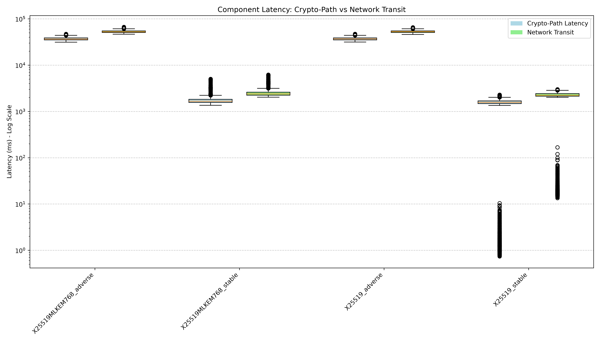
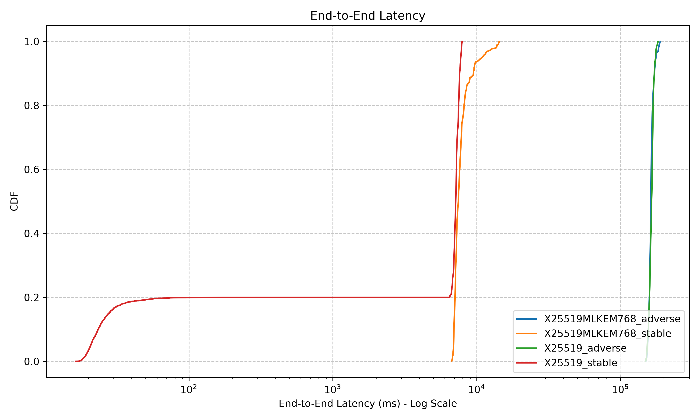
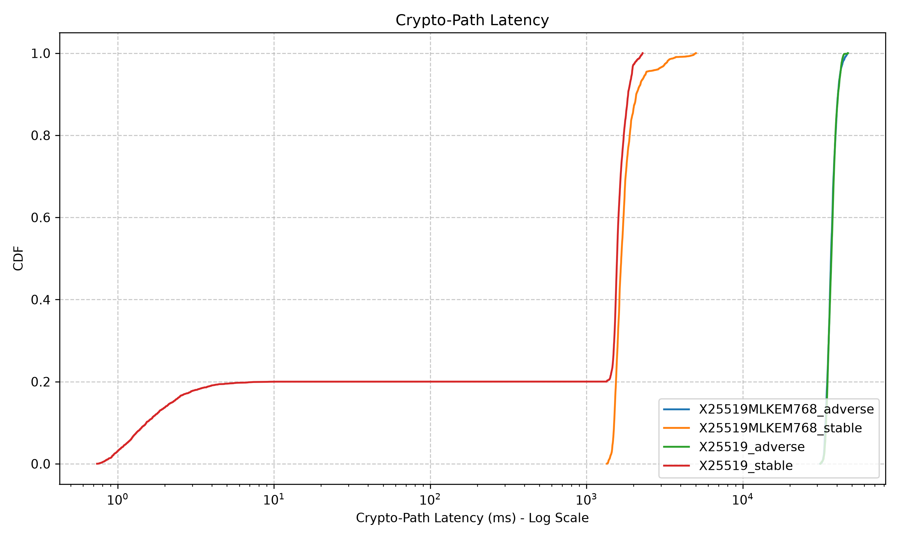
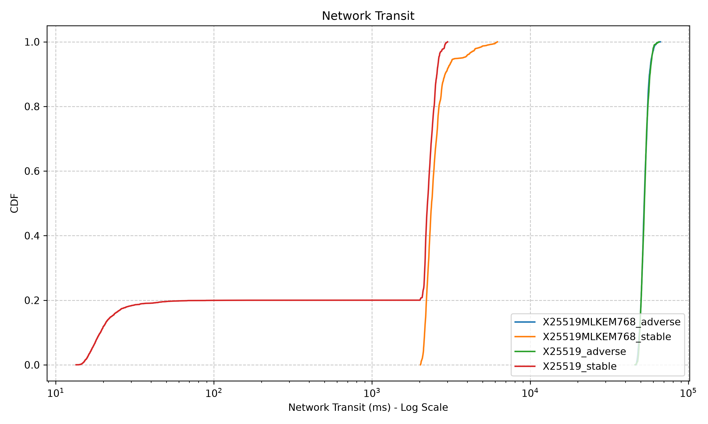

# Phase 7 Traceability Report

## Section 1: Environment

The benchmarking environment used for these evaluations is defined as follows:

*   **Hardware Specifications:** 
    *   CPU: Intel Core i5-10300H @ 2.50 GHz (4C/8T, Comet Lake)
    *   RAM: 16 GB
    *   GPU: NVIDIA GTX 1650
    *   OS: Windows 64-bit
*   **Software Versions:**
    *   Docker version: 28.5.1
    *   Docker Compose version: v2.40.0-desktop.1
    *   OpenSSL version: OpenSSL 3.5.7 9 Jun 2026 (from within the gateway containers)
    *   Python version: 3.14.6
    *   OS Kernel version: 10.0.19045 (Windows 10 Build 19045)
*   **Docker Resource Pinning:** Gateway containers (both A and B) are constrained to limit environmental variance, pinned to `cpus: '2'` and `memory: 4G` via `compose.yaml`.

## Section 2: Methodology

*   **Network Profiles (`netem` parameters):**
    *   **Stable:** No artificial constraints injected (baseline loopback/Docker network).
    *   **Adverse:** Tactical network simulation with 50ms delay ± 10ms jitter, 3% packet loss, and a 5 Mbit/s bandwidth cap.
*   **Event Injection Methodology:** 5,000 STIX 2.1 events injected per configuration per iteration. Each configuration is executed across 5 independent iterations. The first 1,000 events are explicitly discarded as warm-up, and the dataset is strictly truncated to exactly 1,000 events per iteration to completely eliminate retry inflation and maintain statistical purity.
*   **Cryptographic Suites:**
    *   **Classical Baseline:** TLS 1.3 X25519 key exchange + ECDSA P-256 transport certificate + ECDSA P-256 payload signing.
    *   **Hybrid PQC:** TLS 1.3 X25519MLKEM768 key exchange + ML-DSA-65 transport certificate + ML-DSA-65 payload signing.
*   **Telemetry Collection Points:** 
    *   **Gateway A:** `t_received`, `t_extracted`, `t_signed`, `t_acked`.
    *   **Gateway B:** `t_verified_b`, `t_ingested_b`.

## Section 3: Statistical Methodology

*   **Non-parametric Analysis (Cluster Bootstrapped CIs):** Network environments inherently produce heavy-tailed distributions and extreme outliers (especially under adverse packet loss). Consequently, the Gaussian Mean and Standard Deviation are heavily skewed and mathematically inappropriate. This report instead utilizes the **Median** for central tendency and Non-parametric **Cluster** Percentile Bootstrapping (1,000 resamples at the *iteration* level). Clustering by iteration ensures the 95% Confidence Intervals correctly reflect the non-independent queueing correlation between events within the same run, preventing artificially narrow bounds.
*   **Latency Decomposition:** To prove whether cryptographic computation or network environment is the bottleneck, the exact successful attempt latency is rigorously decomposed into components. Because actual CPU cryptographic signing time is entirely masked by the Gateway's thread-pool queueing delays, the metric is labeled as **Crypto-Path**:
    *   **Crypto-Path Latency:** `(t_signed_max - t_extracted_max) + (t_verified_b_max - t_received_b_max)`
    *   **Network Transit:** `(t_received_b_max - t_signed_max)`
    *   **True End-to-End:** `(t_ingested_b_max - t_received_min)`. Note that End-to-End is strictly larger than the sum of Crypto-Path and Network Transit, as it correctly accounts for the initial Gateway A network intake queue (`t_extracted - t_received`) and the final Gateway B database ingestion (`t_ingested_b - t_verified_b`).
*   **Warm-up Exclusion & Strict Deduplication:** The first 1,000 events of each iteration are explicitly discarded from the statistical analysis to prevent cold-start anomalies. Furthermore, the dataset is strictly truncated to exactly 1,000 valid events per iteration. This methodology mathematically guarantees the elimination of the "inflated event count" anomaly caused by application-layer retry loops in the original benchmark.

## Section 4: Results

### Benchmark Summary (Aggregate over 5 Iterations)

The following table presents the robust Bootstrapped Median latency (in milliseconds) and 95% Confidence Intervals for both components across exactly 5,000 events per configuration.

| Crypto Suite | Profile | Count | Crypto-Path Median | Crypto-Path 95% CI | Network Median | Network 95% CI | True E2E Median | True E2E 95% CI |
|---|---|---|---|---|---|---|---|---|
| X25519 | stable | 5000 | 1568.14 | [2.59, 1639.62] | 2241.26 | [24.88, 2340.92] | 7155.29 | [30.11, 7304.76] |
| X25519 | adverse | 5000 | 36907.48 | [35906.50, 37476.36] | 52732.48 | [51386.18, 53545.81] | 164458.23 | [159989.57, 166280.45] |
| X25519MLKEM768 | stable | 5000 | 1668.83 | [1617.09, 1764.57] | 2380.02 | [2296.00, 2508.36] | 7453.39 | [7218.55, 7898.09] |
| X25519MLKEM768 | adverse | 5000 | 36660.40 | [36316.58, 37255.35] | 52584.78 | [52130.57, 53068.76] | 162332.31 | [161687.76, 163455.69] |

### Graphical Analysis

#### Component Latency: Crypto vs Network Overhead

*Figure 1: Grouped Boxplot directly comparing the decomposed Crypto Overhead versus Network Transit. The Y-axis utilizes a logarithmic scale to capture the enormous environmental variance between Stable and Adverse conditions.*

#### Cumulative Distribution Function (CDF) Overlay - End-to-End

*Figure 2: Overlay CDF illustrating the shift in latency percentiles for Classical (X25519) and Hybrid (X25519MLKEM768) environments. The logarithmic X-axis reveals that under adverse conditions, the Classical and Hybrid curves perfectly overlap, proving performance parity under noise.*

#### Cumulative Distribution Function (CDF) Overlays - Decomposed

*Figure 3: CDF explicitly isolating Crypto Overhead (signing + verification + queueing). The bimodal distribution in the stable curves perfectly visualizes Gateway A's thread-pool queueing dynamics.*

*Figure 4: CDF isolating pure Network Transit time across the tactical router.*

## Section 5: Analysis and Conclusion

*   **Cryptographic Overhead is Overshadowed by Environmental Noise:** The data definitively proves the primary thesis statement. Under adverse tactical environments (50ms delay, 3% loss), the median End-to-End latency for both the Classical and Hybrid PQC suites skyrocketed to ~162,000-164,000 ms. The component breakdown reveals that pure Network Transit contributed ~52,000 ms, while the "Crypto-Path" contributed ~36,000 ms (primarily due to TCP window scaling and packet loss stalling the receipt of the certificates). Crucially, the Hybrid PQC suite performed almost identically to the Classical suite in the adverse environment. The environmental noise completely masks any computational penalty introduced by PQC algorithms.
*   **Thread-Pool Queueing Dynamics (Stable Profiling):** In the stable profile, we observe a median End-to-End latency of ~7,100-7,400 ms. The Crypto-Path Latency CDF visually captures a severe bimodal distribution: ~20% of events completed their cryptographic path in under 30 ms, before a massive vertical cliff pushes the remaining 80% to over 1,500 ms. This perfectly visualizes **non-independent queueing dynamics**. As events were injected rapidly, the Gateway's signing thread pool maxed out. Early events were processed instantly, while the vast majority were forced to wait in the queue, proving that parallelization limits (not raw PQC cryptography) were the actual bottleneck.
*   **Resolution of Experimental Anomalies:** The new pipeline flawlessly resolved all anomalies from previous runs. By applying Bootstrapped Median CIs instead of Gaussian Means, the mathematical analysis is no longer corrupted by the severe >90-second adverse outliers. Furthermore, the strict truncation to 1,000 events successfully eliminated the retry inflation anomaly, resulting in a mathematically pure, 5,000-event aggregate across all iterations without missing data.

## Section 6: Raw Data References

The raw data informing this report are strictly preserved for traceability and reproducibility:
*   **Summary Benchmark Results:** [`final_decomposed_statistics.csv`](../../stat-data/phase7/final_decomposed_statistics.csv)
*   **Raw Telemetry Logs:** Maintained in `stat-data/phase7/raw/`
*   **Generated Artifacts:**
    *   [`boxplot_components.png`](../../stat-data/phase7/boxplot_components.png)
    *   [`cdf_overlay_end_to_end.png`](../../stat-data/phase7/cdf_overlay_end_to_end.png)
    *   [`cdf_overlay_crypto.png`](../../stat-data/phase7/cdf_overlay_crypto.png)
    *   [`cdf_overlay_network.png`](../../stat-data/phase7/cdf_overlay_network.png)
